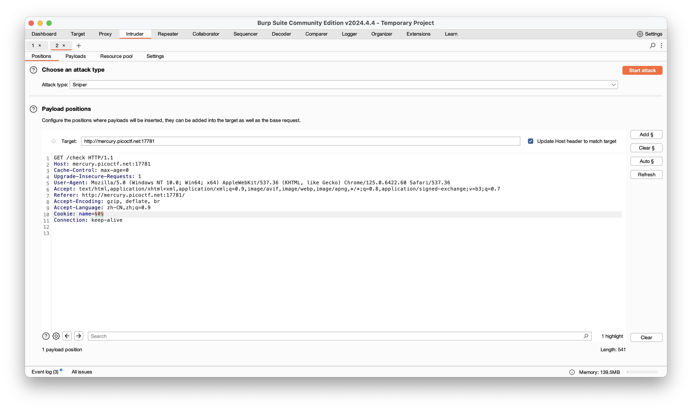

### Web Exploitation

##### GET aHEAD

We can easily find when we use GET method,the background would be red but blue by POST. According to hint

> Maybe you have more than 2 choices

Maybe the choices coordinate with REQUEST method.According to the title,we try to repeat the request using HEAD method.Hence,we find the solution.

You can utilize the tools like curl or burpsuite to carry out this case.

```shell
curl -I -i http://mercury.picoctf.net:47967/index.php
```

##### Cookies

Certainly we should edit cookies to get right answer.We use burpsuite to find out more details.Following the prompt,we input snickerdoodle to search.What sets it apart from other inputs like 1,2,3 is its cookies become 0 from -1 and api /check.We can reasonably speculate that /check is our target page.So we send it to intruder to exploit its cookies like this:




##### Insp3ct0r

According to the hints, we can reasonably guess that flag was divided into three parts respectively existing in html, css, js source code.We can get Part 1 by CTRL+U, Part 2 by viewing myjs.js, Part 3 by mycss.css.

##### Scavenger Hunt

Part 1 and 2 is in source code(html, css).Part 3's hint is in js' code comments.

> /* How can I keep Google from indexing my website? */

If we want to prevent Google from indexing our website, we can create a  robots.txt file in the root directory of website and set it as Disallow. So try to access this page as [*http://mercury.picoctf.net:44070/robots.txt*](http://mercury.picoctf.net:44070/robots.txt) and notice Part 3 is revealed along with a message as

>  “*I think this is an apache server… can you Access the next flag?* ”

As mentioned in the hint this can be an Apache server so perform brute force attack to find default directory/file and notice [*http://mercury.picoctf.net:44070/.htaccess*](http://mercury.picoctf.net:44070/.htaccess) page is accessible and revealing Part 4 along with a message as

>  “*I love making websites on my Mac, I can Store a lot of information there.*”

We know that .DS_Store (Desktop Services Store) file is a system file  created by the macOS operating system. The primary purpose of .DS_Store  files is to store custom attributes of a folder, such as the position of icons, background color, and other view-related settings. These files  are automatically generated by the Finder, which is the default file  manager on macOS. So try to access this page in browser and notice that Part 5 is found in the page.

##### WebDecode

The flag is base64-encoded and hidden on about.html's source code.

##### where are the robots

Visiting `/robots.txt` and you will get the hint!

##### findme

Firstly we need to login in by `username=test` and `password=test!`. We will be redirected to page `/home` which has no function. You may notice there exist two pages in the middle while redirecting. We could use burpsuite to record HTTP history and review suspicious strings of id.So we get flag.


##### Unminify

just view the source code!