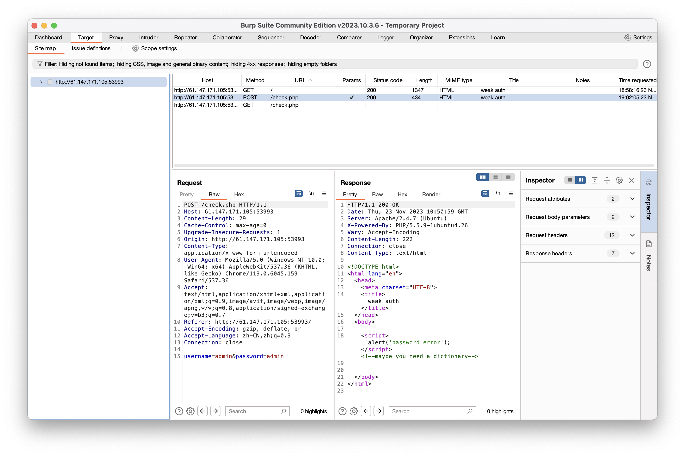
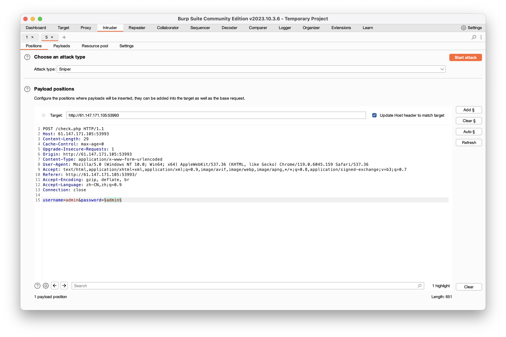
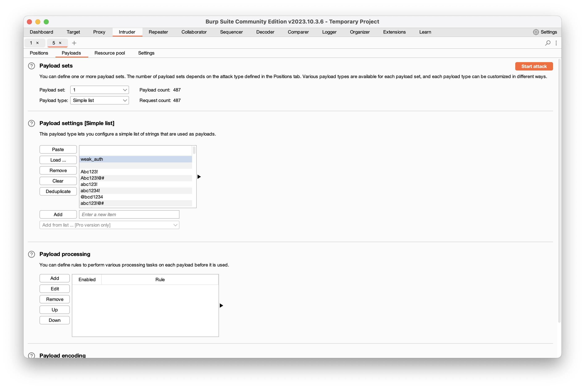
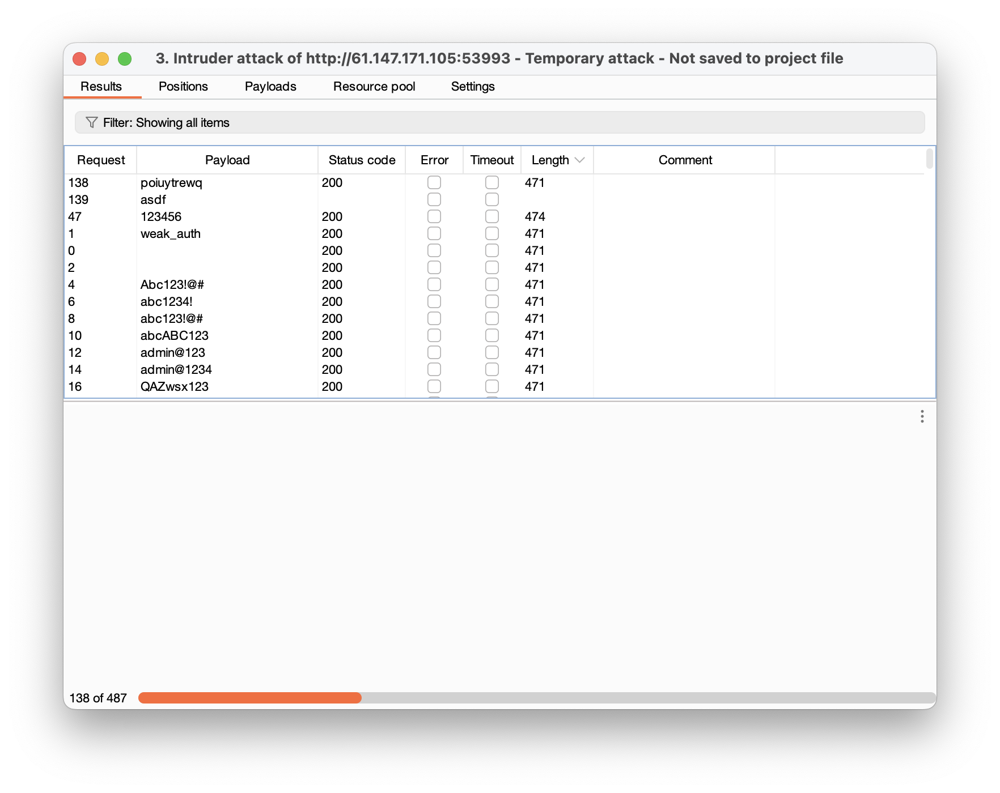
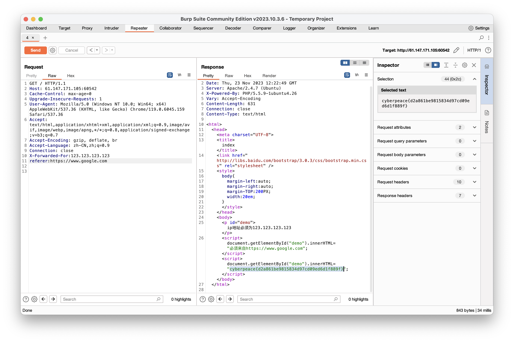

### WEB

#### level 1

##### weak_auth

一道简单的口令爆破，使用burpsuite发送密码字段。

1. 将POST提交到intruder



2. 将password设置为爆破变量



3. Load字典进行爆破，这里随便下了一个字典爆破到密码123456，以后要搜集一些有用的字典，在GitHub上找到一个开源的字典不清楚它的泛用性https://github.com/a3vilc0de/PentesterSpecialDict



##### PHP2

打开index.phps查看php源代码，需要我们输入id的值使它为admin，由于代码中有url解码函数我们需要对参数进行两次编码

```php
?id=%2561%2564%256d%2569%256e
```

##### file_include

payload:

```php
?filename=php://filter/convert.iconv.UTF-8*.UTF-32*%20/resource=flag.php
```

check.php:

```php
<?php 
  if($_GET["filename"]){
    $preg_match_username = 'return preg_match("/base|be|encode|print|zlib|quoted|write|rot13|read|string/i", $_GET["filename"]);'; 
    if (eval($preg_match_username)) { die("do not hack!"); } } 
?>
```

参考：https://blog.csdn.net/m0_74979597/article/details/132782590

#### level 2

##### xff_referer

一道练习使用repeater的入门题，只要修改xff和referer信息再重发即可。对于有些题目可能会过滤X- Forwarded-For字段，可以参考[web新手赛讲解](https://www.bilibili.com/video/BV1mb411R7LR?p=24&vd_source=babc412cd285c7f3e7b58102a5465f0f)。


