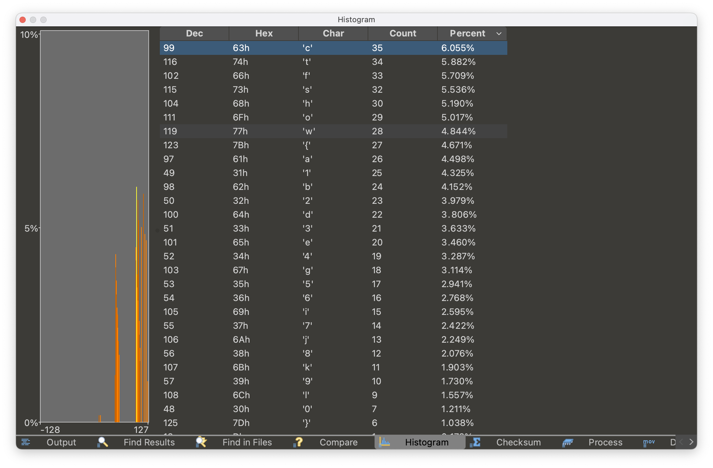
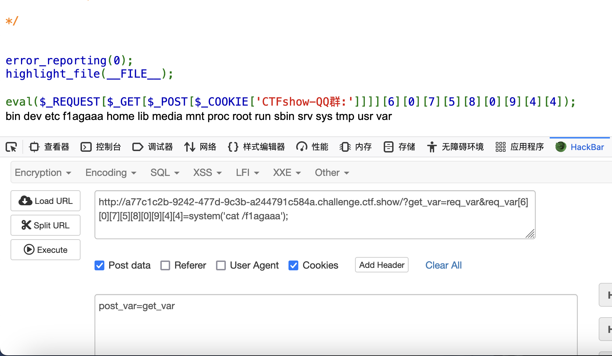

## 菜狗入门题writeup

[TOC]

##### 一、杂项签到

使用010 editor查找ASCII的ctf字段，找到flag。

##### 二、损坏的压缩包

使用010 editor查看文件类型，将文件格式改为png。

##### 三、谜之栅栏

使用010 editor的compare files功能找到不同字段。

##### 四、你会数数吗

使用010 editor的histogram功能对可见字符数进行排序。



##### 五、你会异或吗

使用010 editor的hex operations功能进行0x50异或得到正常图片。

##### 六、flag一分为二

额Mac上不好操作直接找了[wp](https://blog.csdn.net/m0_68012373/article/details/128960816)。

##### 七、我是谁

一道网页交互和图像处理的题目，看[脚本](./src/whoami.py)。

##### 八、you and me

盲水印的题目，直接用GitHub开源的BlindWaterMark-master。

##### 九、我吐了你随意

unicode零宽字符的题目，用[网站工具](http://330k.github.io/misc_tools/unicode_steganography.html)解码。

##### 十、web签到

按源代码要求用hackbar提交内容执行打印flag操作。注意使用cookie传参的时候对CTFshow-QQ群:=post_var进行url编码。



##### 十一、我的眼里只有$

```shell
_=a&a=b&b=c&c=d&d=e&e=f&f=g&g=h&h=i&i=j&j=k&k=l&l=m&m=n&n=o&o=p&p=q&q=r&r=s&s=t&t=u&u=v&v=w&w=x&x=y&y=z&z=A&A=B&B=C&C=D&D=E&E=F&F=G&G=H&H=I&I=system('ls /');
```

##### 十二、抽老婆

任意文件读取的题目，下载网页flask框架下的[app.py](./src/getwifi.py)，修改后本地部署，将本地的cookie中session中复制到远程，调用验证session的getflag函数`@app.route('/secret_path_U_never_know',methods=['GET'])`，也可以看网上另一种[方法](https://blog.csdn.net/weixin_45908624/article/details/128575744?ops_request_misc=&request_id=&biz_id=102&utm_term=ctfshow%20抽老婆&utm_medium=distribute.pc_search_result.none-task-blog-2~all~sobaiduweb~default-3-128575744.142%5Ev81%5Ekoosearch_v1,201%5Ev4%5Eadd_ask,239%5Ev2%5Einsert_chatgpt&spm=1018.2226.3001.4187)。

