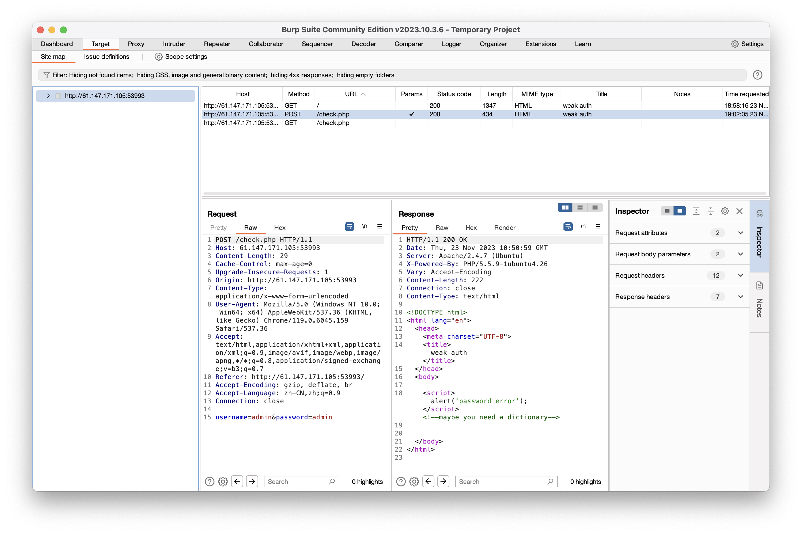
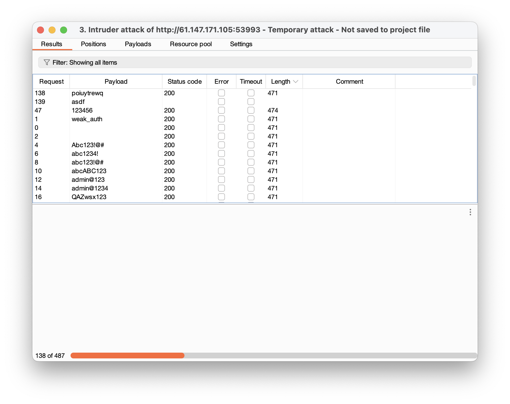

# WEB

[TOC]

# level 1

### weak_auth

一道简单的口令爆破，使用burpsuite发送密码字段。

1. 将POST提交到intruder

2. 将password设置为爆破变量

3. Load字典进行爆破，这里随便下了一个字典爆破到密码123456，以后要搜集一些有用的字典，在GitHub上找到一个开源的字典不清楚它的泛用性https://github.com/a3vilc0de/PentesterSpecialDict

