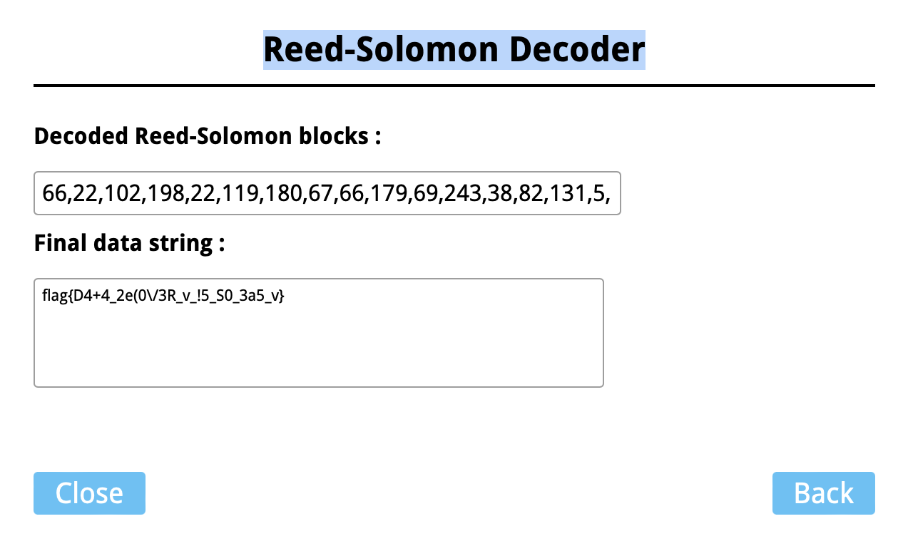
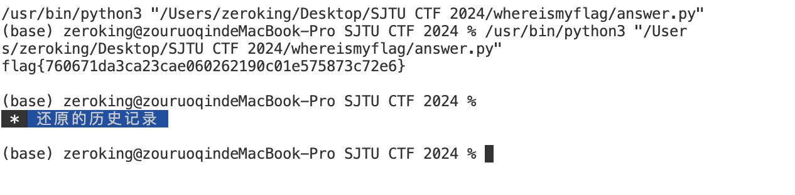

# SJTU-CTF 2024 Writeup

[TOC]

## 个人信息

平台用户名：M0dZer0
	总排名：18

## MISC

### QrCode2

题目给的二维码主要都是纠错信息，缺少数据部分。首先在QrazyBox上将二维码已有的信息还原，二维码版本设置为v3（29x29），纠错等级设置为M0,先把二维码手撸上去，有画图软件的应该可以加上定位直接识别，但我没有。撸上去之后利用它强大的Data Sequence Analysis分析，发现纠错码几乎完整，数据部分几乎没有。先恢复一下padding。按照二维码数据部分的规律一个一个看，看到了终止符前面正好是}的二进制，猜想数据部分就是一个flag。而且数据部分第一位正好有0110，正好是字母f二进制的前四位，那就把数据部分的首五位（从右下角往上数）依次修改为flag{，就可以把二维码恢复成这个样子。


然后用Reed-Solomon Decoder算一下就恢复出flag了。

### WhereIsMyFlag

按照题目给的代码跑一遍发现还是\x1f\x8b\x08开头，感觉应该多多次压缩了，所以用脚本多次解压。

```python
import gzip
import base64
# 压缩数据
compressed_data = base64.b64decode('H4sIAAAAAAACA5Pv5mAAASbmt3cNuf9EzT3+sN5nQrdr2jIOrcbXJmHROjnJAouEuzN5jcq4Fbf6bN1wVlfNYInA9KvHri/k2HjhUVbxzHOHlB5vNdhWdDOpzPyo0Yy7S+6LFzyoXBVc/0r/+ffe+TVfEr8u/dF93/3if9td8//+Ff//8WK4HQMUNL7+V9J/3fBA+2Ojea/lmaCiC7PLMzf1Mt3zjTvJCBU6+Pp00v6/Ah92xQpbQoUUKm7azN2meyBZkk/cFi52vlpmbXQD0LhshLq3er7XdB2+533y4oOKccTFi/1+63HgdZnvE6hQw4PUzyW3tjH0p1rEfIGL2b4v3JLH2He6Yt1TuNjW3SaR2xnu7j6pjbCiNvLNdmXG9bdNJzJDxZqmn72ceZvJZtrDgotwse97jl/cxWqh93jnNLjY9XeXUu4ylbxXW49wytfUjff7WPbkXXdBuNjMf3ku94eItsOu/DCxe5/l3F+LPdjR8zwKoW639+RS7gt7Z++ZhLBi+tE6a6HRwBsNvNHAGw280cAbDbzRwBsNPETgff/8c/3l6bfX1355+POl/P+f7P/n1n17/L7239/8ufs8Ztf/fWr+mP/P/rrvL+vrbP59m1/39Wf/vh/T///y/vb102R/u9/b4///3m4v9+/D9vof7+bv/zX7v2bdr375Xe//6DOe7GOObudnAAAdRZxfbAoAAA==')

k = 0
# 迭代解压缩，直到解压后的数据不再以 gzip 标识符开头
while compressed_data.startswith(b'\x1f\x8b\x08'):
    compressed_data = gzip.decompress(compressed_data)
    k += 1
# 打印解压缩后的文本内容
print(compressed_data.decode('utf-8'))
print(k)
```



### f and r

先在Windows里把包展开遍历一下内容，找到了关键的f和r文件夹，里面是两个不同大小的curl.exe，猜测是不同版本的补丁。问一问万能的Google，搜索关键词Extracting and Diffing Windows Patches，可以出来几篇文章，搜索结果第一页每篇读了一下，发现要利用正确的版本补丁来完成，根据包里的XML文件的链接找到微软官方的KB5034203更新msu文件，提取其中的f和r文件。利用其中的r文件和题目给出的f文件进行处理，就可以得到我们想要的包含flag字符串`flag{ dc1d03c554150a cedca6d71ce394 }`的二进制文件。

